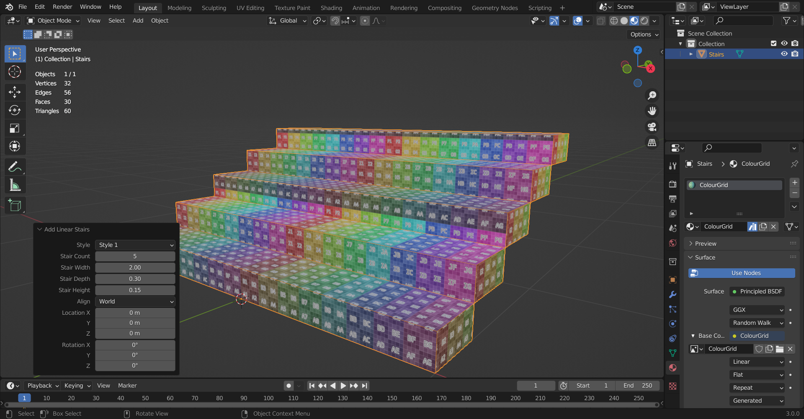

# Linear Stairs Generator

## Table of Contents
1. [Installation](#installation)
2. [Usage](#usage)
3. [Screenshots](#screenshots)
4. [Important Notes](#important-notes)

## Requirements
* Blender 3.0 or newer.

## Installation:
1. Download a zip file from the releases section or generate one by running create_package.py.
2. In Blender, go to Edit->Preferences->Addons, click on Install and select the zip file.

## Usage:
Click on 'Add->Mesh->Add Linear Stairs'.

## Screenshots

## Important Notes:
* At the moment, the add-on doesn't generate UVs.
* This add-on is still very much work-in-progress so some things may not function properly.
